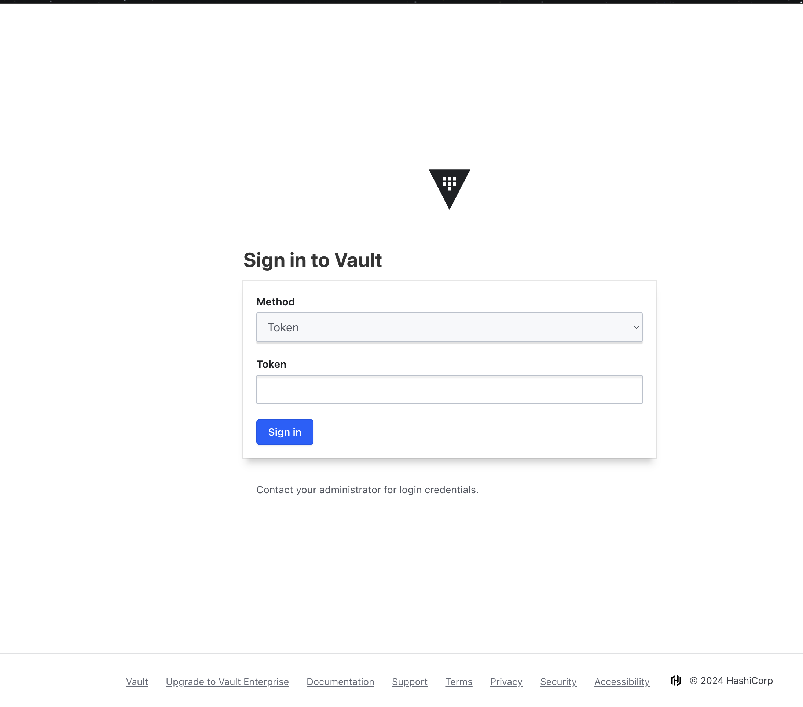

University: [ITMO University](https://itmo.ru/ru/)

Faculty: [FICT](https://fict.itmo.ru)

Course: [Introduction to distributed technologies](https://github.com/itmo-ict-faculty/introduction-to-distributed-technologies)

Year: 2024/2025

Group: K4112C

Author: Slusarenko Sergey Valdimirovich

Lab: Lab1

Date of create: 18.12.2024

Date of finished: 18.12.2024

# Лабораторная работа №1 "Установка Docker и Minikube, мой первый манифест."


## Установка утилиты minikube

```bash
brew install minikube

brew unlink minikube
brew link minikube
```

## На выходе получаем утилиту миникуба

## Старт кластера миникуба

```bash
minikube start
```

## Запуск CLI интерфейса kubectl

```bash
minikube kubectl
```

## Написать манифест для развертывания "пода" HashiCorp Vault

для того, чтобы манифест запустить нужно описать поведение запуска в vault-deployment.yaml

```yaml
apiVersion: v1
kind: Pod
metadata:
  name: vault
  labels:
    app: vault
spec:
  containers:
    - name: vault
      image: hashicorp/vault:latest
      ports:
        - containerPort: 8200
---
apiVersion: v1
kind: Service
metadata:
  name: vault-service
spec:
  selector:
    app: vault
  ports:
    - protocol: TCP
      port: 8200
      targetPort: 8200
  type: NodePort
```

после этого, запустим наш minicube и применим наш новый манифест

```bash
kubectl apply -f /Users/svslyusarenko/2024_2025-introduction_to_distributed_technologies-k4112c-slusarenko_s_v/lab1/vault-deployment.yaml
```

статус пода

```bash
❯ svslyusarenko@MSK-KGG7VJKN73 lab1 % kubectl get pods

NAME    READY   STATUS              RESTARTS   AGE
vault   0/1     ContainerCreating   0          39s
```

статус сервисов

```bash
❯ svslyusarenko@MSK-KGG7VJKN73 lab1 % kubectl get services 

NAME            TYPE        CLUSTER-IP       EXTERNAL-IP   PORT(S)          AGE
kubernetes      ClusterIP   10.96.0.1        <none>        443/TCP          4m34s
vault-service   NodePort    10.100.138.222   <none>        8200:32508/TCP   2m15s
```

получем url для доступа к vault 

```bash
❯ minikube service vault-service --url

http://127.0.0.1:50353
```

как результат получаем ui волта



## Ответы на вопросы

### Что произошло?

Мы создали инструкцию по запуску кластера, иначе говоря манифест и запустили его с помощью команды kubectl apply -f vault-deployment.yaml. Как результат получили запущенный сервис и ui, как его часть

### Как найти токен?

```bash
 >kubectl logs vault

Unseal Key: zNJs21uEh1qJYIFRghBebWShyBnpnPZJGpKBMC1h3zw=
Root Token: hvs.s7lHlsS9n2QuCGeiHK4Ec6sG
```

Там можем увидеть наш токен, по которому и зайдем в сервис

