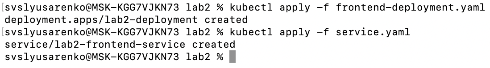
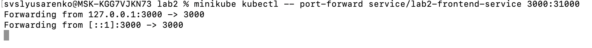
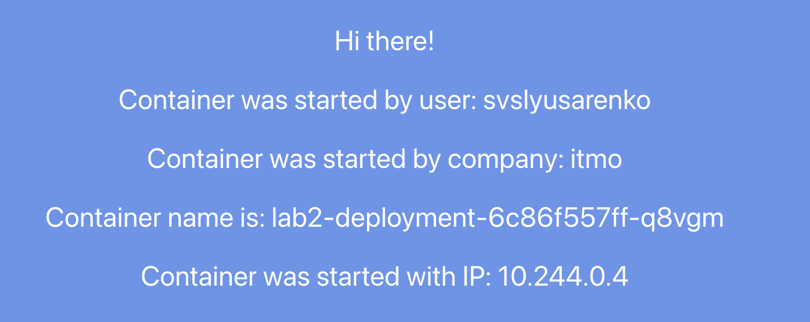

University: [ITMO University](https://itmo.ru/ru/)

Faculty: [FICT](https://fict.itmo.ru)

Course: [Introduction to distributed technologies](https://github.com/itmo-ict-faculty/introduction-to-distributed-technologies)

Year: 2024/2025

Group: K4112C

Author: Slusarenko Sergey Valdimirovich

Lab: Lab1

Date of create: 19.12.2024

Date of finished: 19.12.2024

# Лабораторная работа №2 "Развертывание веб сервиса в Minikube, доступ к веб интерфейсу сервиса. Мониторинг сервиса."


## Создаем deployment, содержащий 2 репликами контейнера по образу ifilyaninitmo/itdt-contained-frontend:master и передать переменные в эти реплики: REACT_APP_USERNAME, REACT_APP_COMPANY_NAME

```
apiVersion: apps/v1
kind: Deployment
metadata:
  name: lab2-deployment
spec:
  replicas: 2
  selector:
    matchLabels:
      app: lab2
  strategy:
    type: RollingUpdate
  template:
    metadata:
      labels:
        app: lab2
    spec:
      containers:
      - image: ifilyaninitmo/itdt-contained-frontend:master
        name: itdt-contained-frontend
        ports:
        - containerPort: 3000
        env:
        - name: REACT_APP_USERNAME
          value: "svslyusarenko"
        - name: REACT_APP_COMPANY_NAME
          value: "itmo"
```

## Создаем сервис через который у вас будет доступ на эти "поды". Выбор типа сервиса остается на ваше усмотрение.

```
apiVersion: v1
kind: Service
metadata:
  labels:
    app: lab2-frontend
  name: lab2-frontend-service
spec:
  type: NodePort
  ports:
    - name: http
      port: 31000
      targetPort: 3000
  selector:
    app: lab2
```

## Старт кластера миникуба

```bash
minikube start
```

## Запуск CLI интерфейса kubectl

```bash
minikube kubectl
```

## Результат:



## Проброс портов:



## Запущенный фронтенд:

