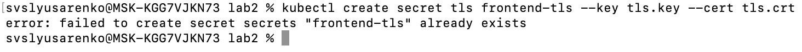

University: [ITMO University](https://itmo.ru/ru/)

Faculty: [FICT](https://fict.itmo.ru)

Course: [Introduction to distributed technologies](https://github.com/itmo-ict-faculty/introduction-to-distributed-technologies)

Year: 2024/2025

Group: K4112C

Author: Slusarenko Sergey Valdimirovich

Lab: Lab1

Date of create: 18.12.2024

Date of finished: 18.12.2024

# Лабораторная работа №3 "Сертификаты и "секреты" в Minikube, безопасное хранение данных."

## Описание
В данной лабораторной работе вы познакомитесь с сертификатами и "секретами" в Minikube, правилами безопасного хранения данных в Minikube.

## Создание ConfigMap с переменными окружения

```yaml
apiVersion: v1
kind: ConfigMap
metadata:
  name: configmap
data:
  REACT_APP_USERNAME: "svslyusarenko"
  REACT_APP_COMPANY_NAME: "itmo"
```

## Cоздание replicaSet с 2 репликами контейнера ifilyaninitmo/itdt-contained-frontend:master

```yaml
apiVersion: apps/v1
kind: replicaSet
metadata:
  name: lab3-replicaset
spec:
  replicas: 2
  selector:
    matchLabels:
      app: lab3-server
  template:
    metadata:
      labels:
        app: lab3-server
    spec:
      containers:
        - name: lab3-server
          image: ifilyaninitmo/itdt-contained-frontend:master
          ports:
            - containerPort: 3000
          env:
            - name: REACT_APP_USERNAME
              valueFrom:
                configMapKeyRef:
                  name: lab3-configmap
                  key: REACT_APP_USERNAME
            - name: REACT_APP_COMPANY_NAME
              valueFrom:
                configMapKeyRef:
                  name: lab3-configmap
                  key: REACT_APP_COMPANY_NAME
```

## Включаем Ingress в Minikube:

```bash
minikube addons enable ingress
```

## Создадим и добавим серты в секреты 

```bash
openssl req -x509 -nodes -days 365 -newkey rsa:2048 -keyout tls.key -out tls.crt -subj "/CN=your.fqdn.com/O=YourOrg"
kubectl create secret tls frontend-tls --key tls.key --cert tls.crt
```




```bash
kubectl apply -f ./configmap.yaml

kubectl apply -f ./replicaSet.yaml

kubectl apply -f ./ingress.yaml
```